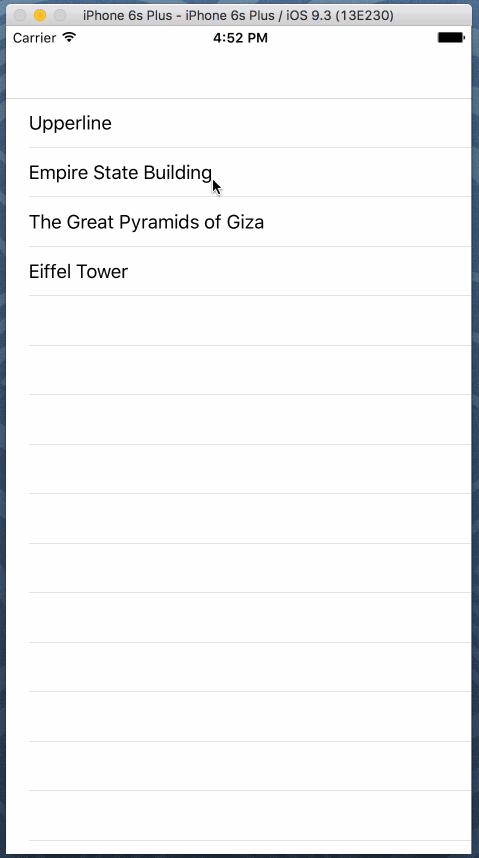

# Tableview Lab

Let's take a step further from our MapKit lab and create a tableview for our favorite locations.

The goal of this lab is create a tableview with all our favorite locations that will then segue into a view that contains a map with its location, it's name, and a fun fact/piece of trivia about the location.

Goals to hit:

1. Create your model for Location that contains the name, latitude & longitude (or CLLocation), and fun fact.
2. Use a tableview controller to create your tableview
3. Embed your page in a navigation controller.
4. Segue information to the next view (which should use a view controller)
5. Build your "More Info" view using a map and two labels.
6. Use constraints

Like before, we have provided you a few locations to start with. Feel free to use different ones or add to these!

                         Name | Lat            | Long           | Fun Fact
------------------------------|----------------| -------------- |:--------------------------------------------------------------------:|
 Upperline School of Code     |  40.709        | -74.010        | Upperline is, officially and unequivocally, the coolest place on earth. 
 Empire State Building        |  40.748        | -73.986        | The building itself cost $24,718,000 to build, when the cost of the land is included this figure climbs to $40,948,900. This cost was less than half of the total anticipated cost due to the Great Depression.
 The Great Pyramids of Giza   |  29.979        | 31.134         | The pyramid is estimated to have around 2,300,000 stone blocks that weigh from 2 to 30 tons each and there are even some blocks that weigh over 50 tons.
 The Eiffel Tower             |  48.858        | 2.295          | The Eiffel Tower was built for the 1889 Paris Exposition and was not intended to be permanent.